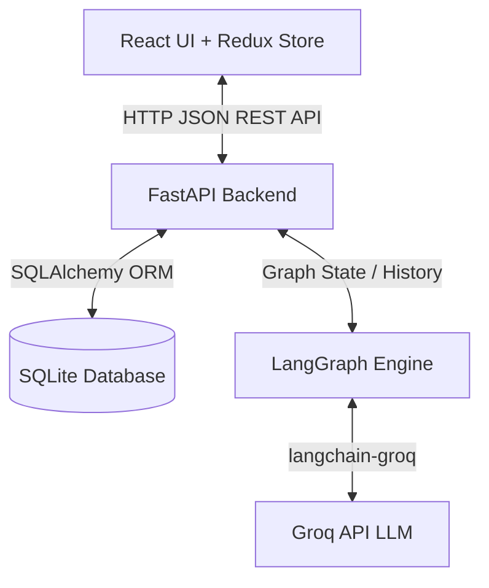

# AI-First CRM HCP Module – Log Interaction Screen

This project is a high-fidelity, feature-complete replica of the **Log HCP Interaction Screen** designed for life science sales representatives. It utilizes a split-screen design featuring a structured details panel on the left and a conversational AI assistant on the right. 

Direct user inputs on the left-side form are disabled (read-only) to enforce the requirement that **all interaction logs and edits are controlled dynamically via the AI assistant chat on the right**.

---

## 🏗️ Technical Architecture



### 1. Frontend: React & Redux
- **Framework**: Vite + React.
- **State Management**: Redux Toolkit manages global states for the interaction form, chat histories, catalog item search results, and loading parameters.
- **Styling**: Tailored Vanilla CSS utilizing CSS variables, Inter Google Font, glassmorphism card panels, custom scrollbars, and micro-animations (pulse buttons, sliding messages, modal pops).
- **Interactive Modals**: Full search capabilities for HCPs, materials, and samples, syncing directly with database records.
- **Voice Note Simulation**: Replicates the "Voice Note" button. Clicking it records/summarizes a clinical transcript and automatically fills out the form via the LangGraph agent.

### 2. Backend: FastAPI & Python
- **Database**: SQLite (default for instant run) with SQLAlchemy. The code is abstracted to support PostgreSQL or MySQL by setting the `DATABASE_URL` environment variable.
- **AI Agent Framework**: **LangGraph** compiles a state graph containing conversation history, active form values, and suggested next steps.
- **LLM Engine**: Groq console API running `gemma2-9b-it` (or `llama-3.3-70b-versatile`).
- **💡 Smart Fallback Parser**: If the `GROQ_API_KEY` environment variable is not configured, the backend automatically activates a regex/heuristics-based fallback mode. This ensures all interaction logs, corrections, search commands, and recommendations are parsed and executed locally on the interface.

---

## 🛠️ The Five LangGraph Tools

The LangGraph agent coordinates state using five custom tools:

1.  **`log_interaction`** (Mandatory): Takes a natural language prompt, extracts CRM entities (`hcp_name`, `date`, `time`, `interaction_type`, `sentiment`, `topics_discussed`, `outcomes`, `follow_up_actions`, and `attendees`), and updates the form state.
2.  **`edit_interaction`** (Mandatory): Target-updates a single field (e.g. correcting a name to "Dr. John" or changing sentiment to "Negative") while preserving all other form parameters.
3.  **`search_materials_and_samples`**: Searches the SQL catalog database for clinical trials, patient brochures, or sample kits and adds them to the form's shared lists.
4.  **`get_hcp_profile`**: Retrieves details about an HCP (specialty, clinic, past interaction history) from the CRM database and pre-fills details.
5.  **`generate_follow_up_tasks`**: Assesses discussion topics to dynamically populate recommended next steps in the **AI Suggested Follow-ups** panel.

---

## 💾 Database Schema

The database contains five primary tables:
- **`hcps`**: Tracks Healthcare Professionals (Name, Specialty, Email, Phone, Organization, History Notes).
- **`materials`**: Catalog of marketing and clinical materials (name, type, product).
- **`samples`**: Catalog of product samples (name, dosage, product).
- **`interactions`**: Logs final reports submitted by the Sales Rep.
- **`suggested_follow_ups`**: Stores tasks generated for the CRM.

---

## 🚀 Setup & Execution Instructions

### Step 1: Set Up the Backend
1. Create an environment configuration file named `.env` inside the `backend/` directory:
   ```env
   GROQ_API_KEY=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
   DATABASE_URL=sqlite:///./hcp_crm.db
   ```
   *(Note: This uses the Groq key you provided. If you ever need to run in local fallback mode, you can simply clear the `GROQ_API_KEY` value.)*

2. Open a terminal and run the following commands to install dependencies, seed the database, and start the FastAPI server:
   ```powershell
   # Navigate to backend folder
   cd "c:\Users\jaive\Desktop\AI-First CRM HCP Module – Log Interaction Screen (Technical)\backend"

   # Install requirements
   python -m pip install -r requirements.txt

   # Seed database tables
   python -m app.seed

   # Run FastAPI server
   python -m uvicorn app.main:app --host 127.0.0.1 --port 8000 --reload
   ```
   *The API server will run at `http://localhost:8000`. You can inspect the interactive swagger docs at [http://localhost:8000/docs](http://localhost:8000/docs).*

### Step 2: Set Up the Frontend
1. Open a **new terminal window** and run the following commands to install node packages and boot the Vite development server:
   ```powershell
   # Navigate to frontend folder
   cd "c:\Users\jaive\Desktop\AI-First CRM HCP Module – Log Interaction Screen (Technical)\frontend"

   # Install React/Redux dependencies
   npm install

   # Start Vite dev server
   npm run dev
   ```
2. Open your web browser and go to **[http://localhost:5173](http://localhost:5173)** to run the application.

---

### 🧹 Port Handling (Troubleshooting)
If you ever stop the servers and get a "Port already in use" error when restarting the backend:
```powershell
# Find process running on port 8000
netstat -ano | findstr :8000

# Force kill that process (replace PID with the number from the command above)
taskkill /F /PID <PID_NUMBER>
```

---

## 🧪 Interactive Testing Guide

Use the following prompts in the **AI Assistant** chat panel (right side) to verify all five tools:

1.  **Log Interaction Tool**:
    *   *Prompt*: `Today I met with Dr. Smith and discussed product OncoBoost efficiency. The sentiment was positive and I shared the brochures.`
    *   *Result*: The form on the left gets populated. HCP Name changes to "Dr. Smith", Date to today's date, Sentiment to "Positive", and "CardioShield Brochure" / "OncoBoost Phase III PDF" are added.
2.  **Edit Interaction Tool**:
    *   *Prompt*: `Sorry, the name was actually Dr. John and the sentiment was negative.`
    *   *Result*: The form updates "Dr. Smith" to "Dr. John" and Sentiment to "Negative", while keeping dates and discussion topics intact.
3.  **Search Materials / Samples Tool**:
    *   *Prompt*: `Search for OncoBoost starter kit samples and add it.`
    *   *Result*: Matches "OncoBoost 10mg Starter Kit" from the database and appends it to the Samples Distributed list.
4.  **HCP Profile Retrieval Tool**:
    *   *Prompt*: `Tell me about Dr. Sharma's profile notes.`
    *   *Result*: Assistant queries the database, replies with his profile history, and sets HCP Name to "Dr. Sharma".
5.  **Follow-up Recommendation Tool**:
    *   *Prompt*: `What follow-up tasks do you recommend for this meeting?`
    *   *Result*: Populates the **AI Suggested Follow-ups** panel at the bottom left. Clicking any of these suggested items (e.g. `+ Send OncoBoost Phase III PDF`) will send it as a message to add it to the form.
